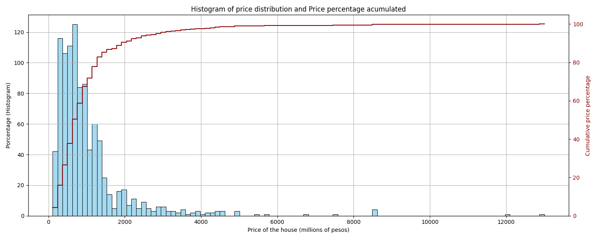

# House Bogotá Price Model

## Project Overview:

- This project employs data obtained through web scraping to predict housing prices in Bogotá based on various property characteristics.
- Data cleaning and transformation is performed using libraries such as Pandas and NumPy, preparing the dataset for machine learning model training.
- An exploratory data analysis (EDA) revealed significant insights regarding property features and their influence on pricing.
- The final model selected for prediction is a XGBoost Regressor, which performed exceptionally well on the test dataset with a MAE of 148.
- The project structure includes dedicated folders for processing, feature engineering, and model evaluation, making it modular and easy to understand.

## Motivation:

Understanding the dynamics of housing prices is crucial in a rapidly urbanizing city like Bogotá. This project aims to provide valuable insights for potential homebuyers and investors by accurately predicting real estate prices based on various attributes. The significance of this project lies in its potential to guide financial decisions by providing a clearer understanding of market trends.

The choice of tools like Scrapy and Selenium for data scraping, along with machine learning libraries such as scikit-learn, streamlines the process of gathering and analyzing data. These tools allow not only efficient data collection but also robust model training and evaluation, thereby addressing the challenges of predicting complex outcomes like housing prices effectively.

## Code and Resources:

- Main libraries used include: Pandas, Numpy, Scikit-learin, Seaborn, Matplotlib.
- To install the necessary libraries, run:
  ```bash
  pip install -r requirements.txt
  ```

## Data Collection:

Data for this project was sourced through web scraping, primarily from a Colombian housing website. The detailed methodology for scraping can be found in the linked project: [House Scraping Web](https://github.com/JohnQuintero08/house_scraping_web).

## EDA:

Some notable findings from the exploratory data analysis include:

- The distribution of housing prices showcased a right-skewed trend, indicating that most properties fall within lower price ranges, with few high-value outliers.
- Around 96% of the houses have a price lower than 3000 millions pesos.
- The stratum 3 and 4 is predomiinant over the others.
- The area is the most correlated variable with the price as they have similar distribution.

  
_Histogram of price distribution_

## Processing and Feature Engineering:

Several processing steps were undertaken for feature engineering, including:

- Handling of outlier entries with HDBSCAN algorith.
- Encoding categorical variables and normalizing numerical features to ensure the effectiveness of various machine learning algorithms.
- Creation of new variables based on existing features to enhance the model's predictive power as rooms per area and total amenities.

## Model Building:

In the model building phase, different regression models were tested, including:

- Linear Regression
- Random Forest Regressor
- XGBoost

## Model Performance:

The selected model for optimization was the XGBoost, which demonstrated superior performance metrics, including a Mean Absolute Error (MAE) on the test dataset. The XGBoost model had a 27% MAE reduction compared to the Liner Regression. Finally the mean error percentage after optimizartion for the test dataset was 19%.

## Pipeline:

To run the project, navigate to the pipeline directory and follow the instructions outlined in the README file.
